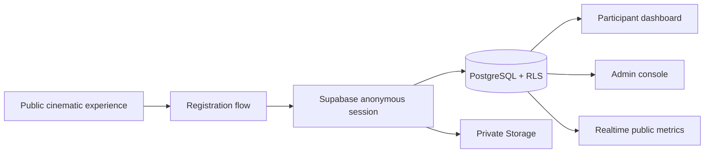

# CreateX 3.0 — Design the World of 2050

<p align="center">
  
</p>

<p align="center">
  A cinematic UI/UX competition experience and full competition-management platform.<br />
  Greek mythology meets a speculative civilization from 2050.
</p>

<p align="center">
  <a href="https://cre8x-3-scrollytelling.vercel.app"><strong>Open the live experience</strong></a>
  · <a href="#local-development">Run locally</a>
  · <a href="#supabase-setup">Configure Supabase</a>
</p>


## The experience

CreateX 3.0 challenges undergraduates to imagine and design meaningful digital products, services and systems for 2050. The public site is built as an immersive journey through **Past → Present → Future → 2050**, while the application layer supports the complete participant and organizer workflow.

- Cinematic scroll-scrubbed hero story with Greek-tech transformation
- Black, champagne-gold and marble visual system
- Cinzel display typography and Sora interface typography
- Optical glass surfaces, metallic details and restrained particle motion
- Interactive 2050 innovation-domain constellation
- Realtime participant, team and solo-registration counters
- Purpose-built mobile layouts and reduced-motion support
- Accessible navigation, focus states, form labels and semantic status messaging


## Platform capabilities

### Participants

- Solo registration or teams of up to four
- Unique team invite codes and participant IDs
- Private undergraduate ID uploads
- Participant and team dashboard
- Dynamic round status, deadlines and submissions
- Announcement and notification center
- Eligibility review status and QR digital pass

### Organizers

- Role-protected `/admin` console
- Registration, eligibility and team management
- Dynamic competition rounds and public visibility controls
- Registration capacity enforced in PostgreSQL
- Announcement publishing and finalist states
- Participant CSV export and event check-in architecture
- Realtime public metrics driven by database triggers

### Security

- Supabase Row Level Security on every exposed table
- Private Storage buckets for student IDs and submissions
- Ownership checks based on `auth.uid()`
- Database-enforced team capacity, unique codes and registration limits
- Protected admin roles stored in `admin_users`
- No Supabase secret/service-role key in browser code

## Technology

| Layer | Technology |
| --- | --- |
| Application | Next.js 16 App Router, React 19, TypeScript |
| Styling | Hand-authored responsive CSS, `next/font` |
| Data | Supabase PostgreSQL, Realtime and Storage |
| Authentication | Supabase anonymous participant sessions; authenticated staff roles |
| Validation | Zod plus PostgreSQL constraints |
| Deployment | Vercel |



## Local development

Requirements: Node.js 22 or newer and npm.

```bash
git clone https://github.com/CodeJediX/cre8x-3-scrollytelling.git
cd cre8x-3-scrollytelling
npm install
copy .env.example .env.local
npm run dev
```

Open [http://localhost:3000](http://localhost:3000).

```bash
npm run dev        # local development
npm run typecheck  # TypeScript verification
npm run build      # production build
npm start          # serve the production build
```

## Environment variables

Copy `.env.example` to `.env.local` and provide:

```env
NEXT_PUBLIC_SUPABASE_URL=https://your-project.supabase.co
NEXT_PUBLIC_SUPABASE_PUBLISHABLE_KEY=sb_publishable_replace_me
NEXT_PUBLIC_SITE_URL=http://localhost:3000
```

`RESEND_API_KEY` and `RESEND_FROM_EMAIL` are optional for branded transactional mail. Never commit `.env.local`, a Supabase secret key or a service-role key.

## Supabase setup

1. Create a Supabase project.
2. In **Authentication → Sign In / Providers**, enable **Allow anonymous sign-ins**. Participant registration uses a secure anonymous session and only collects the submitted email as contact information; it does not require email verification or an email login.
3. Add the project URL and publishable key to `.env.local` and to the Vercel project.
4. Apply the committed database migrations:

```bash
npx supabase login
npx supabase link --project-ref YOUR_PROJECT_REF
npx supabase db push
```

5. Create the first staff administrator only after that staff member has a Supabase Auth user:

```sql
insert into public.admin_users (user_id, role)
select id, 'super_admin'
from auth.users
where email = 'OFFICIAL_ADMIN_EMAIL';
```

Available roles are `super_admin`, `admin` and `checkin_staff`. Never authorize admin access with a frontend email comparison.

## Database and Storage

The migrations in [`supabase/migrations`](supabase/migrations) create:

- `profiles`, `teams`, `team_members`, `registrations`
- `competition_rounds`, `submissions`
- `announcements`, `notifications`, `event_settings`, `faqs`
- `checkins`, `admin_users`, `registration_metrics`
- private `profile-images`, `student-ids`, `pretask-submissions` and `final-submissions` buckets
- public `event-assets` bucket

Competition states, dates, capacity, venue text and public announcements are data-driven. Update those records through the admin console instead of hard-coding launch information.

## Project structure

```text
app/                  Next.js routes, API handlers and global design system
components/           Public experience, registration, dashboards and admin UI
lib/                  Supabase clients, data services, validators and types
public/assets/         CreateX artwork, logo, preloader and cinematic video
supabase/migrations/   Schema, RLS, Storage, functions and Realtime metrics
```


## Release checks

- Run `npm run typecheck` and `npm run build`.
- Test a valid registration, duplicate email, invalid file and full team.
- Verify mobile layouts at 320, 375, 430, 768 and 1024 px.
- Confirm User A cannot read User B's profile, documents or submissions.
- Confirm normal participants cannot access admin mutations.
- Replace the marked venue/contact placeholders when official details are approved.
- Confirm the Supabase anonymous provider is enabled before opening registration.

## Brand note

The CreateX logo and supplied competition artwork are official project assets. Do not recolor, distort or redistribute them independently of the CreateX 3.0 experience.

---

**THE FUTURE IS NOT FOUND. IT IS DESIGNED.**
